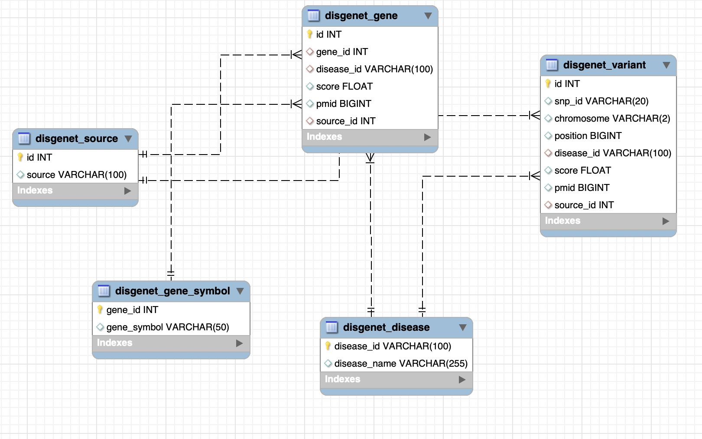
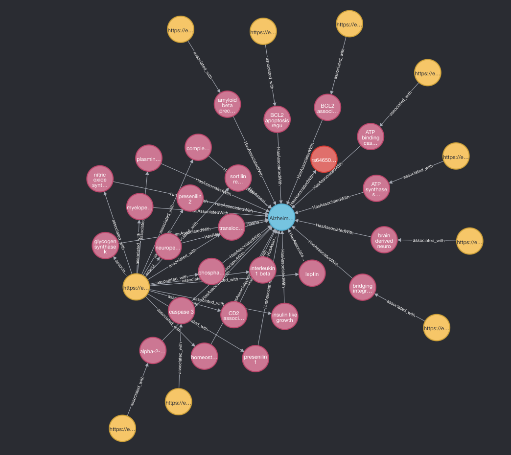

# disgenet_muskan

## Description

The disgenet_muskan package is a versatile Python tool designed to seamlessly harness the rich resources of [DisGeNET](https://www.disgenet.org), one of the largest publicly available collections of genes and variants associated with human diseases. DisGeNET is a pioneering discovery platform that integrates data from expert-curated repositories, GWAS catalogues, animal models, and the scientific literature. It is homogeneously annotated with controlled vocabularies and community-driven ontologies, and provides original metrics for genotype-phenotype relationship prioritization.
One of the primary goals of the DisGeNET_Muskan package is to enrich and extend Neo4j graph databases by seamlessly integrating the data of disease-gene and variant information from DisGeNET.The package streamlines the process of data extraction, transformation, and import into Neo4j, ultimately providing a powerful tool for graph-based analysis and discovery within the realm of human genetics and disease research.

## Installation

```python
pip install disgenet_muskan
```
You can also download the latest version from [PyPI website](https://test.pypi.org/project/disgenet-muskan/)

To completely run the disgent_muskan package also install neo4j package from [github](https://github.com/cebel/neo4j-tools.git) website maintained and created by [Christian Ebeling](christian.ebeling@scai.fraunhofer.de) with the help of the script below in your virtual environment.
```python
pip uninstall neo4j_tools -y
pip install -U git+https://github.com/cebel/neo4j-tools.git
```
To utilize a Podman container, you have the option to download the Podman file from the "podman_compose" folder and execute the following command:
```python
podman-compose up -d
```
This command will initiate the containerized environment. If the Podman file is not present, you can provide users with the capability to download it.
## Package Structure
This package consists of following files:
- [constant](src/disgenet_muskan/constants.py)
  Consists of all the strings and url used in the other files of the package.

- [DBconnect](src/disgenet_muskan/DBconnect.py)
  Consists of SQLAlchemy engine used to connect to the database.
- [disgenet](src/disgenet_muskan/disgenet.py)
  This file consists of the emthods used to fill the database.
- [models](src/disgenet_muskan/models.py)
  Consists of the data models used to create the tables from the Data downloaded from Disgenet website.
- [stdnames](src/disgenet_muskan/stdnames.py)
  Consists of functions used to convert ugly/unacceptable names into standard names.
- [disgenet_rdf](src/disgenet_muskan/disgenet_rdf.py)
  Consists of methods used to create and configure the RDF file and convert it into turtle format.
- [importer](src/disgenet_muskan/importer.py)
  Consists of wrapper functions used to Download Data, populate the Database and create Neo4j graph from the Turtle file.

## Data Description
- Data is downloaded from the Disgenet website with the help of following [link](https://www.disgenet.org/static/disgenet_ap1/files/downloads/"), it has two files:-
  - [all_gene_disease_pmid_associations](https://www.disgenet.org/static/disgenet_ap1/files/downloads/all_gene_disease_pmid_associations.tsv.gz)
  - [all_variant_disease_pmid_associations](https://www.disgenet.org/static/disgenet_ap1/files/downloads/all_variant_disease_pmid_associations.tsv.gz)
  
- After importing the data with the help of digenet_muskan package disgenet database is filled which consists of 5 tables:
  - disgenet_source
  - disgenet_disease
  - disgenet_gene_symbol
  - disgenet_gene
  - disgenet_variant
  
Description of Data Model with datatypes is included in the [next](#disgenet-model-description) section.
## Disgenet Model Description

## Importing: Getting started

To make it easy for you to get started with disgenet_muskan package,  here's a list of recommended next steps which is needs to be followed:

- Clone this repo into your system or you can download the package from PyPI website as mentioned in section [Installation](#installation) in your virtual environment(proceed to next step)
- Create and activate a virtual environment in your current repository
```python
python3 -m venv .venv
```
```python
source venv/bin/activate
```
- Install the package in your virtual environment if you cloned the repository or you can follow the [Installation](#installation) section.
```python
pip install .
``` 
Do not forget to add neo4j package in your virtual environment
```python
pip uninstall neo4j_tools -y
pip install -U git+https://github.com/cebel/neo4j-tools.git
``` 
Run the following commands to use the methods of the package: 
- Open ipython/python from your terminal
- To create download the data and populate the database call the method populate_data which has two optional attributes engine and update which allows user to update the already exiting files are re-downloaded them if it is True:
  ```python
  from disgenet_muskan.importer import populate_data
  #call the method
  populate_data
  ```
- view the data in PhPmyadmin.
- If you want to create the RDF file in Turtle format use create_ttl method which has two attributes: ttl_file which takes the names of the turtle file (for example: *disgenet.ttl*) and other optional attribute which is engine.
  ```python
  from disgenet_muskan.disgenet_rdf import create_ttl
  #call the method
  create_ttl(ttl_file='disgenet.ttl')
  ``` 
- To create neo4j graph use the method create_neo4jgraph which has three attributes: file, graph_config,delete_nodes.
  ```python
  from disgenet_muskan.importer import create_neo4jgraph
  #if you are creating the graph for the first time or if you want to delete existing nodes then make delete_nodes True
  create_neo4jgraph(file ='disgenet.ttl' , graph_config=True, delete_nodes=True)
  #if you want to add another file and connect the graph to see how they are related
  create_neo4jgraph(file ='hgnc.ttl' , graph_config=False, delete_nodes=False)
  ```
view the graph on neo4J and use the [this](#querying-the-graph) section to query the graph.

## Querying the Graph
we imported the two turtle files from the disgenet data and hgnc data and connect the graph with the help of Gene Uri which was common in the both turtle file and compare them.
Neo4j uses [cypher](https://neo4j.com/developer/cypher/). It is like SQL for graphs, and was inspired by SQL so it lets you focus on what data you want out of the graph. It is easy to use because of its similarity to other languages, and intuitiveness.
Some graph to query the graphs using Neo4J graph using cypher query:
- you can select the nodes using the query below: 
```cypher
MATCH (g:gene)
RETURN g
LIMIT 25
```
```cypher
MATCH (d:disease)
RETURN d
LIMIT 25
```
- You can use where condition to query the graph like this:
```cypher
match p=(d:disease) where d.disease_Name CONTAINS 'Parkinson' return p limit 15
```
- To connect different nodes and see the relationship the below query can be used.
```cypher
match p=(s:snp)--(d:disease)--(g:gene)--(e:ec) where d.disease_Name CONTAINS'Alzheimer' return p limit 25
```
This Cypher query is useful for exploring and retrieving information from a graph database that contains data related to SNPs, diseases, genes, and enzyme classes. Specifically, it is designed to find and retrieve paths that connect SNPs to diseases, genes, and enzyme classes, where the disease is related to Alzheimer's disease.


The usage of digenet_muskan package and to use cypher query can be seen in various scenarios(for instance taking the above example), such as:

- Research: Researchers studying the genetic basis of Alzheimer's disease can use this query to find genetic variants (SNPs) associated with the disease.
- Drug Discovery: Pharmaceutical companies can use this query to identify potential drug targets (genes) associated with Alzheimer's disease.
- Personalized Medicine: Healthcare providers might use this query to understand how a patient's genetic variations (SNPs) are linked to diseases like Alzheimer's, aiding in personalized treatment plans.
- Data Exploration: It allows users to explore complex relationships within a graph database, helping them discover previously unknown connections between genetic variations, diseases, genes, and enzymes.

**Future improvements**:
We tried to connect CheBI data with Hgnc so that we can get the association of chemicals with the disease related gene so for that we created a dummy nodes containing Chebi Information as shown below and tried to connect it with the gene related information present in our database.

create ChEBI node using cypher and adding it's properties:
```cypher
CREATE (chebi:ChEBI {
name: 'amyloid-β',
chebiID: 'CHEBI:64645',
asciiName: 'amyloid-beta',
definition: 'A peptide of 36-43 amino acids that is processed from the amyloid precursor protein. Appears to be the main constituent of amyloid plaques (deposits found in the brains of Alzheimer\'s disease patients).'
})
```
Then connect it manually to the gene PRSEN1 which is aasociated with alzheimer's disease.
```cypher
MATCH (amyloidBeta:ChEBI {chebiID: 'CHEBI:64645'})
MATCH (gene:gene {name: 'presenilin 1'})
CREATE (amyloidBeta)-[:IS_RELATED_TO]->(gene)
```
Then query the graph to see how all the three information are related
```cypher
match p=(g:gene)--(d:disease)--(s:snps),p2=(g:gene)--(c:ChEBI),p3=(g:gene)--(e:ec) where d.disease_Name CONTAINS'Alzheimer' return p,p2,p3 limit 25
```

While the process described above was executed manually, we are actively working on enhancing our package to automate and streamline these connections within the graph. The goal is to make it more efficient, accessible, and insightful for researchers and users looking to explore the intricate relationships between chemicals, genes, and diseases.
## Authors and acknowledgment
Author - Muskan Manav

Special Thanks to my instructor - [Christian Ebeling](christian.ebeling@scai.fraunhofer.de) for their constant support and guidance.
Some of the methods of the disgenet_muskan package is adapted from [e:bel](https://github.com/e-bel), thanks to the contributors [Bruce Schultz](bruce.schultz@scai.fraunhofer.de) & [Christian Ebeling](christian.ebeling@scai.fraunhofer.de) for making the package open source.
## Support
Please reach out via email at muskanmanav16@gmail.com for any questions


